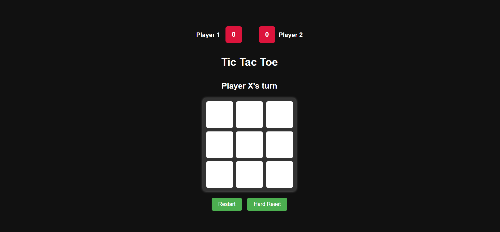

# Tic Tac Toe Game

A simple and interactive Tic Tac Toe game built with HTML, CSS, and JavaScript.

## Features

- Two-player gameplay (Player X and Player O)
- Score tracking with localStorage persistence
- Win detection with visual highlighting of winning cells
- Draw detection
- Restart and hard reset functionality
- Responsive design

## How to Play

1. Players take turns clicking on empty cells
2. Player X always goes first
3. The first player to get 3 of their marks in a row (horizontally, vertically, or diagonally) wins
4. If all cells are filled without a winner, the game ends in a draw
5. Scores are maintained between games until a hard reset

## Controls

- **Restart Button**: Clears the current game board and starts a new game (keeps scores)
- **Hard Reset Button**: Clears both the game board and all saved scores

## Technologies Used

- HTML5
- CSS3
- JavaScript (ES6)
- Web Storage API (for persistent score tracking)

## Installation

No installation required - simply open the `index.html` file in any modern web browser.

## Future Improvements

- Add AI opponent option
- Implement game animations
- Add sound effects
- Mobile app version

## Screenshot

Enjoy the game!
